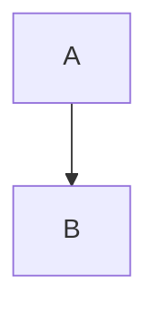

# Diagrams

This directory contains Mermaid diagrams visualizing the Nazaritor architecture, systems, and data flows.

## 📁 Diagram Categories

### Architecture & System Design

- **[architecture-overview.mmd](./architecture-overview.mmd)** - Complete system architecture showing frontend, backend, AI agents, and data layer
- **[monorepo-structure.mmd](./monorepo-structure.mmd)** - Monorepo organization with apps and packages
- **[package-dependencies.mmd](./package-dependencies.mmd)** - Package dependency graph

### Database & Data Model

- **[database-er-diagram.mmd](./database-er-diagram.mmd)** - Entity-relationship diagram for objects and relations tables
- **[data-flow.mmd](./data-flow.mmd)** - Complete data flow from user interaction to database

### Object System

- **[object-type-hierarchy.mmd](./object-type-hierarchy.mmd)** - All 11 object types inheriting from BaseObject
- **[object-relationships.mmd](./object-relationships.mmd)** - How different object types relate to each other
- **[object-lifecycle.mmd](./object-lifecycle.mmd)** - State machine showing object lifecycle
- **[property-types.mmd](./property-types.mmd)** - 15 available property types for objects

### API & tRPC

- **[trpc-router-hierarchy.mmd](./trpc-router-hierarchy.mmd)** - tRPC router structure (current and future)
- **[object-router-procedures.mmd](./object-router-procedures.mmd)** - All procedures in the Object Router
- **[api-create-sequence.mmd](./api-create-sequence.mmd)** - Sequence diagram for object creation
- **[api-error-handling.mmd](./api-error-handling.mmd)** - Error handling flow
- **[type-safety-flow.mmd](./type-safety-flow.mmd)** - End-to-end type safety from schemas to UI

### AI Agent System (Future)

- **[ai-multi-agent-architecture.mmd](./ai-multi-agent-architecture.mmd)** - Multi-agent system architecture
- **[ai-agent-collaboration.mmd](./ai-agent-collaboration.mmd)** - Sequence diagram showing agent collaboration
- **[ai-agent-selection.mmd](./ai-agent-selection.mmd)** - Intent-based agent routing
- **[ai-shared-context.mmd](./ai-shared-context.mmd)** - Shared context system for agents

---

## How to Use These Diagrams

### In GitHub / GitLab / Documentation Sites

Most modern platforms render Mermaid diagrams automatically. Simply reference them in markdown:

\`\`\`markdown
```mermaid
{{include architecture-overview.mmd}}
```
\`\`\`

Or use file includes (if supported):

\`\`\`markdown
!include architecture-overview.mmd
\`\`\`

### In VS Code

1. Install **Markdown Preview Mermaid Support** extension
2. Open any .md file
3. Add mermaid code block with diagram content
4. View preview (Ctrl+Shift+V)

### Online Editors

- **[Mermaid Live Editor](https://mermaid.live/)** - Paste diagram code and see live preview
- **[Mermaid Chart](https://www.mermaidchart.com/)** - Create and share diagrams

### In Documentation

To include these diagrams in documentation:

**Option 1: Copy diagram content into code blocks**

\`\`\`markdown

\`\`\`

**Option 2: Link to the diagram file**

\`\`\`markdown
See [Architecture Overview](./diagrams/architecture-overview.mmd)
\`\`\`

**Option 3: Embed rendered image** (requires build step)

Generate PNG/SVG using Mermaid CLI:

\`\`\`bash
# Install mermaid CLI
npm install -g @mermaid-js/mermaid-cli

# Generate image
mmdc -i architecture-overview.mmd -o architecture-overview.png
\`\`\`

Then reference in markdown:

\`\`\`markdown

\`\`\`

---

## Diagram Maintenance

### When to Update Diagrams

Update diagrams when:

1. **Architecture changes** - New components, services, or data flows
2. **New features added** - Object types, API procedures, agents
3. **Dependencies change** - New packages or external services
4. **Documentation written** - Reference diagrams in guides

### How to Update Diagrams

1. **Edit .mmd file** - Modify Mermaid syntax directly
2. **Test in live editor** - Verify it renders correctly
3. **Update associated .md files** - If diagram was embedded in documentation
4. **Commit changes** - Keep diagrams in sync with code

### Creating New Diagrams

Use these templates as starting points:

**Flowchart/Graph:**
\`\`\`mermaid
graph TD
    A[Start] --> B[Process]
    B --> C[End]
\`\`\`

**Sequence Diagram:**
\`\`\`mermaid
sequenceDiagram
    participant A
    participant B
    A->>B: Message
    B-->>A: Response
\`\`\`

**Entity-Relationship:**
\`\`\`mermaid
erDiagram
    TABLE1 ||--o{ TABLE2 : "relationship"
\`\`\`

**State Diagram:**
\`\`\`mermaid
stateDiagram-v2
    [*] --> State1
    State1 --> State2
    State2 --> [*]
\`\`\`

---

## Quick Reference

### Legend (Colors)

- **Green** (#4CAF50) - Frontend, UI, Read operations
- **Blue** (#2196F3) - Backend, API, Infrastructure
- **Orange** (#FF9800) - Data, Database, Shared packages
- **Purple** (#9C27B0) - AI/Future features, Search
- **Red** (#F44336) - Delete operations, Errors, Builder agent
- **Teal** (#00BCD4) - Shared context, Utilities

### Common Patterns

**Solid lines** = Implemented / Current
**Dashed lines** = Future / Planned
**Bold borders** = Primary/Key components
**Subgraphs** = Logical grouping

---

## Diagram Index by Topic

### "I want to understand..."

**...the overall system**
- architecture-overview.mmd
- monorepo-structure.mmd
- package-dependencies.mmd

**...the database**
- database-er-diagram.mmd
- data-flow.mmd

**...objects and data**
- object-type-hierarchy.mmd
- object-relationships.mmd
- object-lifecycle.mmd
- property-types.mmd

**...the API**
- trpc-router-hierarchy.mmd
- object-router-procedures.mmd
- api-create-sequence.mmd
- api-error-handling.mmd
- type-safety-flow.mmd

**...AI agents (future)**
- ai-multi-agent-architecture.mmd
- ai-agent-collaboration.mmd
- ai-agent-selection.mmd
- ai-shared-context.mmd

---

## Resources

- **[Mermaid Documentation](https://mermaid.js.org/)** - Official Mermaid docs
- **[Mermaid Live Editor](https://mermaid.live/)** - Test diagrams online
- **[Mermaid Cheat Sheet](https://jojozhuang.github.io/tutorial/mermaid-cheat-sheet/)** - Quick syntax reference

---

**Last Updated:** 2025-11-16
**Total Diagrams:** 18
